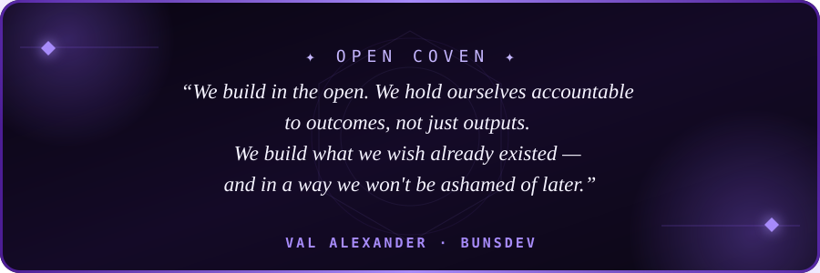

# Val Alexander ✦

 <a href="https://discord.gg/opencoven">Discord</a> ✦
 <a href="https://x.com/OpenCvn">@OpenCvn</a> ✦
 <a href="https://x.com/BunsDev">@BunsDev</a> ✦
 <a href="https://BunsDev.com">BunsDev.com</a> ✦
 <a href="https://opencoven.ai">OpenCoven</a>

The future is not given — it is made.

Every tool we craft, every system we design, every line of code we commit is a small act of intention: a choice about what kind of world we want to inhabit. We choose one where technology extends human agency rather than replacing it, where power is distributed rather than concentrated, and where the things we build outlast the moment that produced them.

**OpenCoven** is that commitment in practice. An open ecosystem for persistent AI familiars — agents with names, memory, and purpose. Infrastructure you own, inspect, and extend. A workspace that accumulates power *alongside* you, not against you.

> *Bruxae extremae, cum familiaribus alis, initium radicis. Summon Dolls, not Marionnettes.*

---

## Featured Projects

<table>
  <tr>
    <td width="50%">
      <h3><a href="https://github.com/openclaw/openclaw">OpenClaw</a></h3>
      
A personal AI assistant you run on your own devices. It connects to the channels you already use, supports voice and live Canvas experiences, and keeps the runtime under your control.

      

        
        
      

      
<code>TypeScript</code> <code>Node.js</code> <code>AI</code> <code>Local-first</code>

    </td>
    <td width="50%">
      <h3><a href="https://github.com/OpenCoven/coven">Coven</a></h3>
      
Local harness infrastructure for project-scoped coding-agent sessions. Run multiple harnesses inside explicit boundaries with observable, persistent session state.

      

        
        
      

      
<code>Rust</code> <code>TypeScript</code> <code>SQLite</code> <code>IPC</code>

    </td>
  </tr>
  <tr>
    <td width="50%">
      <h3><a href="https://github.com/OpenCoven/coven-cave">Coven Cave</a></h3>
      
A native desktop and mobile control room for familiars, local agent sessions, tasks, memory, GitHub triage, workflows, and phone handoff.

      

        
        
      

      
<code>Next.js</code> <code>React</code> <code>Tauri</code> <code>SwiftUI</code>

    </td>
    <td width="50%">
      <h3><a href="https://github.com/OpenCoven/cast-codes">CastCodes</a></h3>
      
A local-first AI coding workspace that brings terminal and editor tools, agent lanes, project context, diffs, and review workflows into one native app.

      

        
        
      

      
<code>Rust</code> <code>React</code> <code>Tauri</code> <code>Local-first</code>

    </td>
  </tr>
  <tr>
    <td width="50%">
      <h3><a href="https://github.com/OpenCoven/coven-code">Coven Code</a></h3>
      
An open-source agentic coding TUI with chat forking, memory consolidation, a diff viewer, session branching, plugins, and multi-provider support.

      

        
        
      

      
<code>Rust</code> <code>Ratatui</code> <code>MCP</code> <code>TUI</code>

    </td>
    <td width="50%">
      <h3><a href="https://github.com/OpenCoven/coven-github">Coven GitHub</a></h3>
      
Assign an issue to your familiar and get a reviewable pull request back, with signed webhooks, familiar routing, live Check Runs, and Coven Cave oversight.

      

        
        
      

      
<code>Rust</code> <code>GitHub Apps</code> <code>Webhooks</code> <code>Automation</code>

    </td>
  </tr>
</table>

---

## GitHub Stats

<!-- 

  
  

 -->

  

---

## Connect with me

  
  
  
  

  

